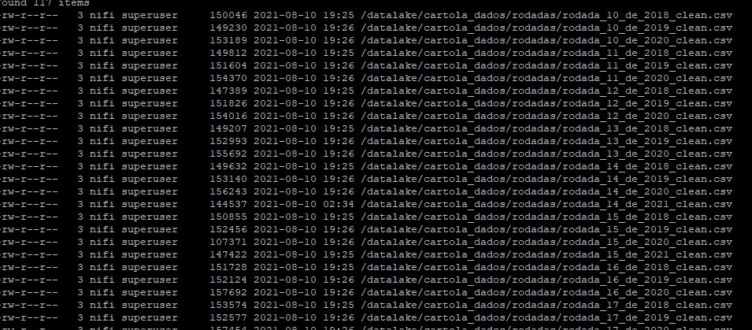

# BIG DATA ECOSYSTEM COM DOCKER - CARTOLA FC

Ambiente para estudo dos frameworks big data em docker.
  Esse setup vai criar dockers com os frameworks HDFS, Hive, Presto, Hue, Metabase, Nifi e Mysql com a seguinte arquitetura:
   

## SOFTWARES NECESSÁRIOS
#### Para a criação e uso do ambiente vamos utilizar git e docker
   * Instalação do Docker ToolBox no Windows faça o download em [Docker](https://drive.google.com/drive/folders/12iEACFEjaWfMcZr4c1o3YAbKE9kiH-lb?usp=sharing) ou o docker no [Linux](https://docs.docker.com/install/linux/docker-ce/ubuntu/)
   *  [Instalação do git](https://git-scm.com/book/pt-br/v2/Come%C3%A7ando-Instalando-o-Git)
   
*OBS: Existe um git na instação do Docker ToolBox, caso já tenha instalado não precisa instalar novamente*

## SETUP
*OBS: Esse passo deve ser realizado apena uma vez. Após o ambiente criado, utilizar o docker-compose para iniciar os containers como mostrado no tópico INICIANDO O AMBIENTE*

#### Criação do diretório docker:
*OBS: A criação do diretório é importante para os mapeamentos necessários*

   *  No Windows:
      *  Criar na raiz do seu drive o diretório docker
         ex: C:\docker
          
   * No Linux:
      * Criar o diretório na home do usuário
        ex: /home/user/docker

#### Em um terminal/DOS, dentro diretório docker, realizar o clone do projeto no github
          git clone https://github.com/fabiogjardim/bigdata_docker.git

#### No diretório bigdata_docker vai existir os seguintes objetos

   *  No Windows:
   
      *Abrir o Docker Quickstart Terminal, isso fará com que a VM default seja criada no VirtualBox*
        

      *No DOS, dentro do diretório bigdata_docker, renomear o arquivo docker-compose_windows.yml para docker-compose.yml*

            move docker-compose_windows.yml docker-compose.yml
      *Executar o arquivo virtualbox_config.bat*
          <i>O arquivo bat cria/reacria a VM default com disco de até 100GB, 8GB de memória, drive do repo compartilhado como /d e todas as portas necessárias mapeadas</i> 
          <i>OBS: se o ser driver raiz for diferente de C:, alterar o arquivo virutalbox_config.bat na parte indicada no comentário. A memória também pode ser alterada no local indicado.</i>   
         
   *  No Linux: *Não é necessário alterar nem executar nada*

## INICIANDO O AMBIENTE
   
  *No Windows abrir o Docker Quickstart Terminal, do Linux um terminal*

* Se Diretório docker não estiver criado  

            $ sudo mkdir ~/docker 

* Todos os passos a serguir devem ser executados apenas uma vez.
* Anotamos as permissões **$** e **#** para se localizar mas na execução remova os characteres para facilitar a execução.

*Clonar Projeto*
 
    $ cd ~/docker
    $ git clone https://github.com/lewney/bigdata-solution-sprint

*Pausar Docker Anterior*

    $ docker-compose stop

*Iniciar Docker*
    
    $ docker-compose up -d 

### Scripts de Ambiente - Projeto

    $ sudo docker exec -it -u 0 nifi dash
    #apt update
    
    Talvez necessite do (#apt list --upgradable)
    
    # apt-get install python3
    # apt-get install python3-pip
    
    # pip3 install pandas
    # pip3 install requests
    # apt-get install vim
    # mkdir -p /temp-conf
    
    # exit
    
    $ sudo docker exec -it nifi dash
    
    $ mkdir -p /tmp/stage
    $ mkdir -p /home/nifi/scripts/python
    $ mkdir -p /home/nifi/scripts/shell
    $ exit
    
    $ sudo docker exec -it datanode dash
    Se o user nifi não existir (# useradd nifi)
    
    ## Cria diretorios para dados brutos dentro do hadoop
    ## Os comandos a seguir para facilitar retirar os # serve apenas para saber o nivel de acesso que esta sendo executado*
    
    # hadoop fs -mkdir -p /datalake/cartola_raw/2021/clubes
    # hadoop fs -mkdir -p /datalake/cartola_raw/2014_2020/clubes
    # hadoop fs -mkdir -p /datalake/cartola_raw/rodadas
    # hadoop fs -mkdir -p /datalake/cartola_raw/partidas
    
    ##Muda permissão da pasta
    # hadoop fs -chown nifi:supergroupr /datalake/cartola_raw/2021
    # hadoop fs -chown nifi:supergroupr /datalake/cartola_raw/2014_2020
    # hadoop fs -chown nifi:supergroupr /datalake/cartola_raw/2021/clubes
    # hadoop fs -chown nifi:supergroupr /datalake/cartola_raw/2014_2020/clubes
    # hadoop fs -chown nifi:supergroupr /datalake/cartola_raw/rodadas
    # hadoop fs -chown nifi:supergroupr /datalake/cartola_raw/partidas
    
    ### Permite acesso a pasta
    # hadoop fs -chmod 755 /datalake/cartola_raw/2021
    # hadoop fs -chmod 755 /datalake/cartola_raw/2014_2020
    # hadoop fs -chmod 755 /datalake/cartola_raw/2021/clubes
    # hadoop fs -chmod 755 /datalake/cartola_raw/2014_2020/clubes
    # hadoop fs -chmod 755 /datalake/cartola_raw/rodadas
    # hadoop fs -chmod 755 /datalake/cartola_raw/partidas
    
    ## Cria diretorios para dados brutos dentro do hadoop
    # hadoop fs -mkdir -p /datalake/cartola_dados/2021/clubes
    # hadoop fs -mkdir -p /datalake/cartola_dados/2014_2020/clubes
    # hadoop fs -mkdir -p /datalake/cartola_dados/rodadas
    # hadoop fs -mkdir -p /datalake/cartola_dados/partidas
    
    ## Mudar user user
    # hadoop fs -chown nifi:supergroupr /datalake/cartola_dados/2021
    # hadoop fs -chown nifi:supergroupr /datalake/cartola_dados/2014_2020
    # hadoop fs -chown nifi:supergroupr /datalake/cartola_dados/2021/clubes
    # hadoop fs -chown nifi:supergroupr /datalake/cartola_dados/2014_2020/clubes
    # hadoop fs -chown nifi:supergroupr /datalake/cartola_dados/rodadas
    # hadoop fs -chown nifi:supergroupr /datalake/cartola_dados/partidas
    
    ### Permite acesso a pasta
    # hadoop fs -chmod 755 /datalake/cartola_dados/2021
    # hadoop fs -chmod 755 /datalake/cartola_dados/2014_2020
    # hadoop fs -chmod 755 /datalake/cartola_dados/2021/clubes
    # hadoop fs -chmod 755 /datalake/cartola_dados/2014_2020/clubes
    # hadoop fs -chmod 755 /datalake/cartola_dados/rodadas
    # hadoop fs -chmod 755 /datalake/cartola_dados/partidas
    # exit
    
    $ sudo docker cp datanode:/etc/hadoop/core-site.xml  /tmp
    $ sudo docker cp datanode:/etc/hadoop/hdfs-site.xml  /tmp
    
    $ sudo docker cp  /tmp/core-site.xml  nifi:/temp-conf
    $ sudo docker cp  /tmp/hdfs-site.xml  nifi:/temp-conf
    
    $ sudo docker inspect namenode | grep '"IPAddress"'
    
    exemplo:
    
                "IPAddress": "",
                        "IPAddress": "172.21.0.2",
    
    Anotar IP
    
    sudo docker exec -it -u 0 nifi dash
    # vim /temp-conf/core-site.xml
    
    Editar:
    <property>
    <name>fs.defaultFS</name>
    <value>hdfs://namenode:8020</value>
    </property>
    
    Para:
    <property>
    <name>fs.defaultFS</name>
    <value>hdfs://172.21.0.2:8020</value>
    </property>
    
    # chmod 755 /temp-conf/core-site.xml
    # exit
    
    ### Carregar Scripts
    
    sudo docker cp ~/docker/bigdata-solution-sprint/data/nifi/scripts/Partida2014.py nifi:/home/nifi/scripts/python			 
    sudo docker cp ~/docker/bigdata-solution-sprint/data/nifi/scripts/Partida2015.py nifi:/home/nifi/scripts/python
    sudo docker cp ~/docker/bigdata-solution-sprint/data/nifi/scripts/Partida2016.py nifi:/home/nifi/scripts/python
    sudo docker cp ~/docker/bigdata-solution-sprint/data/nifi/scripts/Partida2017.py nifi:/home/nifi/scripts/python
    sudo docker cp ~/docker/bigdata-solution-sprint/data/nifi/scripts/Partida2018.py nifi:/home/nifi/scripts/python
    sudo docker cp ~/docker/bigdata-solution-sprint/data/nifi/scripts/Partida2019.py nifi:/home/nifi/scripts/python
    sudo docker cp ~/docker/bigdata-solution-sprint/data/nifi/scripts/Partida2020.py nifi:/home/nifi/scripts/python
    sudo docker cp ~/docker/bigdata-solution-sprint/data/nifi/scripts/Partida2020.py nifi:/home/nifi/scripts/python
    sudo docker cp ~/docker/bigdata-solution-sprint/data/nifi/scripts/Partida2021.py nifi:/home/nifi/scripts/python
    sudo docker cp ~/docker/bigdata-solution-sprint/data/nifi/scripts/Rodada2019.py nifi:/home/nifi/scripts/python
    sudo docker cp ~/docker/bigdata-solution-sprint/data/nifi/scripts/Rodada2021.py nifi:/home/nifi/scripts/python
    sudo docker cp ~/docker/bigdata-solution-sprint/data/nifi/scripts/Rodada2020.py nifi:/home/nifi/scripts/python
    sudo docker cp ~/docker/bigdata-solution-sprint/data/nifi/scripts/Rodada2018.py nifi:/home/nifi/scripts/python
    sudo docker cp ~/docker/bigdata-solution-sprint/data/nifi/scripts/Rodada2014_2017.py nifi:/home/nifi/scripts/python
    sudo docker cp ~/docker/bigdata-solution-sprint/data/nifi/scripts/Clubes2021.py nifi:/home/nifi/scripts/python
    sudo docker cp ~/docker/bigdata-solution-sprint/data/nifi/scripts/Clubes2014_2018.py nifi:/home/nifi/scripts/python
    
    ##script get_partidas shell
    sudo docker cp ~/docker/bigdata-solution-sprint/data/nifi/shell/get_clubes.sh nifi:/home/nifi/scripts/shell
    sudo docker cp ~/docker/bigdata-solution-sprint/data/nifi/shell/get_partidas_2014-2021.sh nifi:/home/nifi/scripts/shell
    sudo docker cp ~/docker/bigdata-solution-sprint/data/nifi/shell/get_rodadas.sh nifi:/home/nifi/scripts/shell
    
    sudo docker exec -it -u 0 nifi dash
    
    # chmod 755 /home/nifi/scripts/python/*
    # chmod 755 /home/nifi/scripts/shell/*

###*Iniciar Nifi*

    http://127.0.0.1:9090/ ou http://localhost:9090

Carregar no nifi o template xml, local de arquivo xml
    
    ~/docker/bigdata-solution-sprint/data/nifi/fiap_def2.xml

*Executar Fluxo Nifi* 

###*Iniciar Hue*

Executar:

    CREATE DATABASE cartola;

Executar arquivos SQL por ordem numerada localizados em:

    ~/docker/bigdata-solution-sprint/data/hue/sql

*Obs:  Caso ocorra o erro:*

Error while compiling statement: FAILED: SemanticException [Error 10096]: Dynamic partition strict mode requires at least one static partition column. To turn this off set hive.exec.dynamic.partition.mode=nonstrict

Executar:

    SET hive.exec.dynamic.partition = true;
    SET hive.exec.dynamic.partition.mode = nonstrict;

### Documento Resposta.doc

    ~/docker/bigdata-solution-sprint/docs/respostas.pdf

### Dados Adicionais

*Evidências*

*Dash Metabase*

### Comandos úteis docker

* Verificar imagens e containers

    docker image ls

    docker container ls

## SOLUCIONANDO PROBLEMAS 
   
  *No Windows abrir o Docker Quickstart Terminal*

### Parar um containers
         docker stop [nome do container]      

### Parar todos containers
         docker stop $(docker ps -a -q)
  
### Remover um container
         docker rm [nome do container]

### Remover todos containers
         docker rm $(docker ps -a -q)         

### Dados do containers
         docker container inspect [nome do container]

### Iniciar um container
         docker-compose up -d [nome do container]

### Iniciar todos os containers
         docker-compose up -d 

### Acessar log do container
         docker container logs [nome do container] 

## Acesso WebUI dos Frameworks
 
* HDFS *http://localhost:50070*
* Presto *http://localhost:8080*
* Metabase *http://localhost:3000*
* Nifi *http://localhost:9090*
* Hue *http://localhost:8888*

## Acesso por shell

   ##### HDFS

          docker exec -it datanode bash

   ##### Sqoop

          docker exec -it datanode bash

## Acesso JDBC

   ##### Hive

          jdbc:hive2://hive-server:10000/default

   ##### Presto

          jdbc:presto://presto:8080/hive/default

## Usuários e senhas

   ##### Hue
    Usuário: admin
    Senha: admin

   ##### Metabase
    Usuário: bigdata@class.com
    Senha: bigdata123 

   ##### MySQL
    Usuário: root
    Senha: secret

## Imagens   

[Docker Hub](https://hub.docker.com/u/fjardim)

## Documentação Oficial

* https://nifi.apache.org/
* https://prestodb.io/
* https://www.metabase.com/
* https://sqoop.apache.org/
* https://hadoop.apache.org/
* https://hive.apache.org/
* https://gethue.com/
* https://github.com/yahoo/CMAK
* https://www.docker.com/
